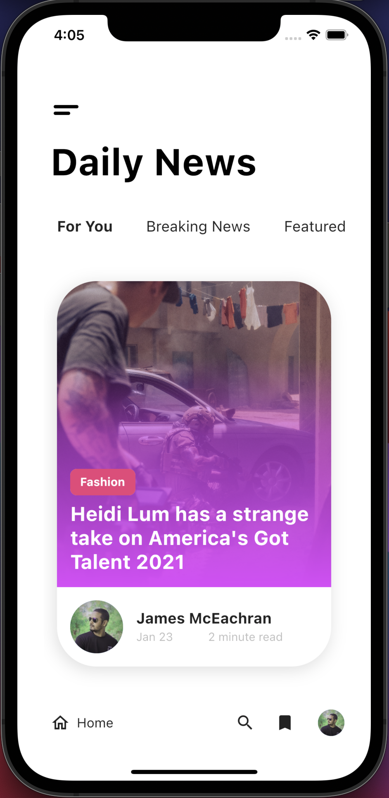

# x_news

[MaterialUp design](https://www.uplabs.com/posts/news-app-ui-41e1eacd-aad4-4c6d-8e83-f5197e2c14b0)

Definitely didn't follow the design to the letter but hey, it's close. Got some ideas for the stacked cards actually.

## Output

Here's what the running app looks like. Just the first page was implemented.

